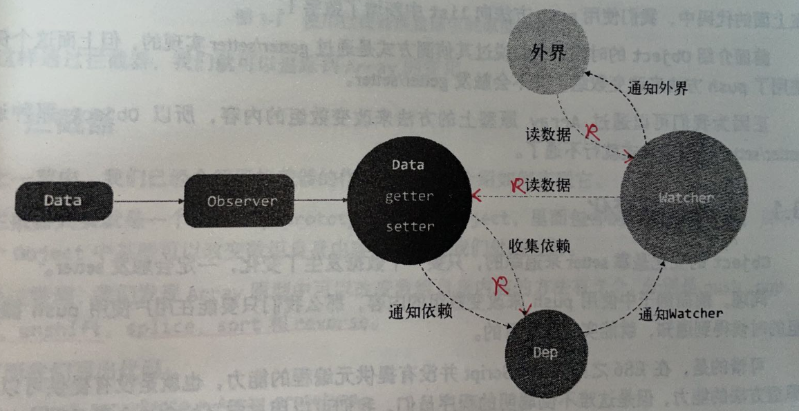

<!--
 * @Author: atdow
 * @Date: 2022-02-10 21:36:03
 * @LastEditors: null
 * @LastEditTime: 2022-02-11 09:44:29
 * @Description: file description
-->
## 变化侦听
```js
function defineReactive(data, key, val){
  Object.defineProperty(data, key, {
    enumerable: true,
    configurable: true,
    get: function(){
      // 收集依赖
      return val;
    },
    set: function(newVal){
      // 触发依赖
      if(val === newVal){
        val = newVal;
      }
    }
  })
}
```
> 在getter中收集依赖（用到对应变量的地方），在setter中触发依赖

依赖收集过程


Watcher构造函数读取了数据，触发了defineProperty的getter，触发依赖收集，将当前Watcher收集到Dep中；Watcher可以主动去订阅任意一个数据的变化


